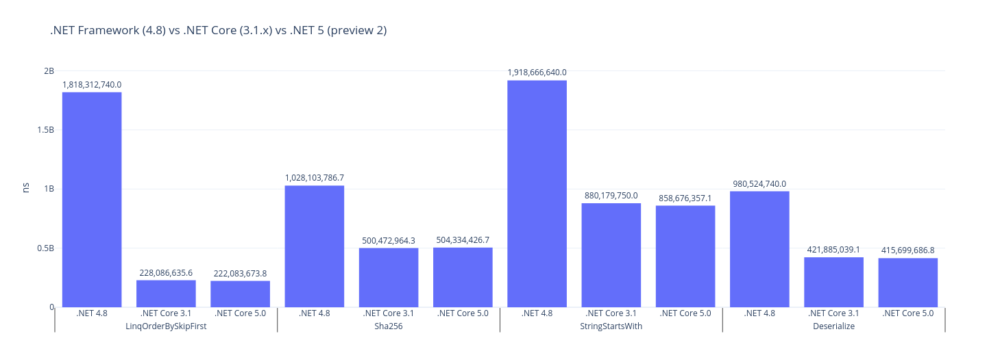
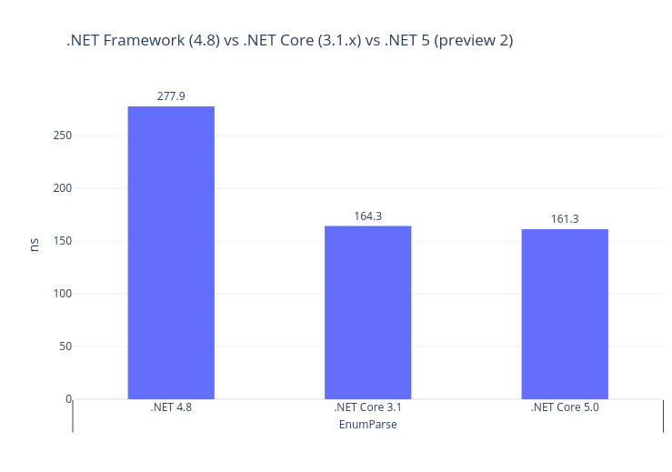
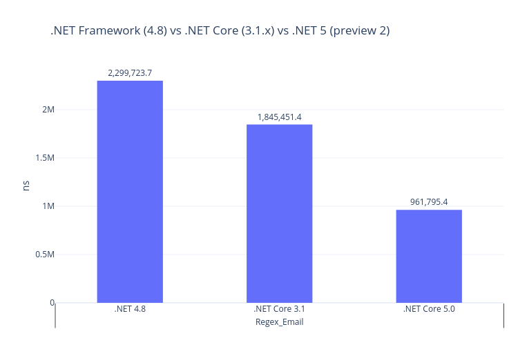
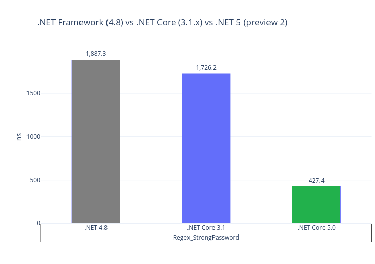
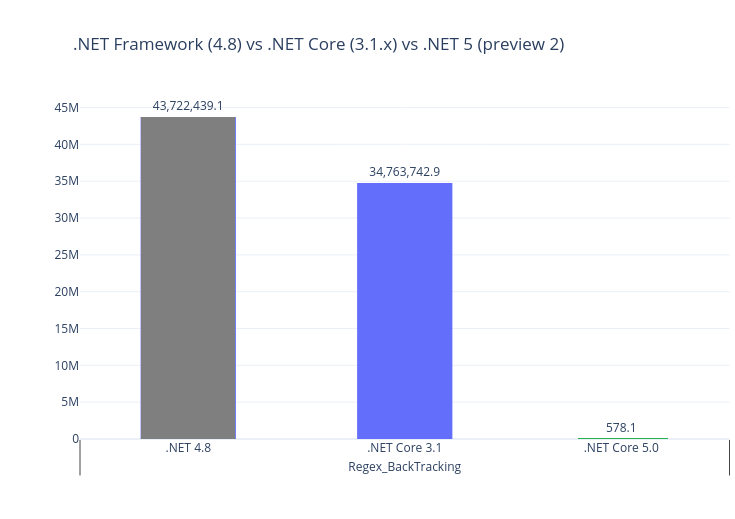

# DotNetFrameworkVsCore - compare multiple .NET runtimes
Small console application to compare performance of **.NET Framework (4.8), .NET Core (3.1.x) and .NET 5 (preview 2)**. Common benchmarks are written in .NET Standard. App contains 5 benchmarks to test performance of .NET Framework (4.8), .NET Core (3.1.x) and .NET 5 (preview 2). Another 4 benchmarks are related to regex performance. Results taken by [BenchmarkDotNet](https://benchmarkdotnet.org/).

### You can easily  check how fast/slow is .NET Framework/.NET Core/.NET 5!


**Try .NET 5 preview 2!** - .NET 5 is fresh, shiny and ready to test. To check new runtime you have to download [Visual Studio 2019 16.6.0 preview](https://visualstudio.microsoft.com/en/vs/preview/) and [.NET 5.0 Preview 2 SDK](https://dotnet.microsoft.com/download/dotnet-core/5.0). In this release .NET Team was focused to improve regex engine.


# .NET Framework (4.8) vs .NET Core (3.1.x) vs .NET 5 (preview 2)

``` ini

BenchmarkDotNet=v0.12.0, OS=Windows 10.0.18363
Intel Core i7-4702MQ CPU 2.20GHz (Haswell), 1 CPU, 8 logical and 4 physical cores
.NET Core SDK=5.0.100-preview.2.20176.6
  [Host]     : .NET Core 3.1.3 (CoreCLR 4.700.20.11803, CoreFX 4.700.20.12001), X64 RyuJIT
  Job-XTAQMF : .NET Framework 4.8 (4.8.4150.0), X64 RyuJIT
  Job-XPHTQE : .NET Core 3.1.3 (CoreCLR 4.700.20.11803, CoreFX 4.700.20.12001), X64 RyuJIT
  Job-YFAAUM : .NET Core 5.0.0 (CoreCLR 5.0.20.16006, CoreFX 5.0.20.16006), X64 RyuJIT


```
|               Method |       Runtime |               Mean | Ratio |
|--------------------- |-------------- |-------------------:|------:|
|            EnumParse |      .NET 4.8 |           277.9 ns |  1.00 |
|            EnumParse | .NET Core 3.1 |           164.3 ns |  0.59 |
|            EnumParse | .NET Core 5.0 |           161.3 ns |  0.58 |
|                      |               |                    |       |
| LinqOrderBySkipFirst |      .NET 4.8 | 1,818,312,740.0 ns |  1.00 |
| LinqOrderBySkipFirst | .NET Core 3.1 |   228,086,635.6 ns |  0.13 |
| LinqOrderBySkipFirst | .NET Core 5.0 |   222,083,673.8 ns |  0.12 |
|                      |               |                    |       |
|               Sha256 |      .NET 4.8 | 1,028,103,786.7 ns |  1.00 |
|               Sha256 | .NET Core 3.1 |   500,472,964.3 ns |  0.49 |
|               Sha256 | .NET Core 5.0 |   504,334,426.7 ns |  0.49 |
|                      |               |                    |       |
|     StringStartsWith |      .NET 4.8 | 1,918,666,640.0 ns |  1.00 |
|     StringStartsWith | .NET Core 3.1 |   880,179,750.0 ns |  0.46 |
|     StringStartsWith | .NET Core 5.0 |   858,676,357.1 ns |  0.45 |
|                      |               |                    |       |
|          Deserialize |      .NET 4.8 |   980,524,740.0 ns |  1.00 |
|          Deserialize | .NET Core 3.1 |   421,885,039.1 ns |  0.43 |
|          Deserialize | .NET Core 5.0 |   415,699,686.8 ns |  0.43 |
|                      |               |                    |       |
|          Regex_Email |      .NET 4.8 |  2,299,723.7 ns |  1.00 |
|          Regex_Email | .NET Core 3.1 |  1,845,451.4 ns |  0.80 |
|          Regex_Email | .NET Core 5.0 |    961,795.4 ns |  0.51 |
|                      |               |                 |       |
| Regex_StrongPassword |      .NET 4.8 |      1,887.3 ns |  1.00 |
| Regex_StrongPassword | .NET Core 3.1 |      1,726.2 ns |  0.91 |
| Regex_StrongPassword | .NET Core 5.0 |        427.4 ns |  0.23 |
|                      |               |                 |       |
|  Regex_SpanSearching |      .NET 4.8 |    339,303.0 ns |  1.00 |
|  Regex_SpanSearching | .NET Core 3.1 |    295,767.1 ns |  0.87 |
|  Regex_SpanSearching | .NET Core 5.0 |     22,660.0 ns |  0.07 |
|                      |               |                 |       |
|   Regex_BackTracking |      .NET 4.8 | 43,722,439.1 ns | 1.000 |
|   Regex_BackTracking | .NET Core 3.1 | 34,763,742.9 ns | 0.809 |
|   Regex_BackTracking | .NET Core 5.0 |        578.1 ns | 0.000 |








## Code details

### Enum:
```csharp
public DayOfWeek EnumParse() => (DayOfWeek)Enum.Parse(typeof(DayOfWeek), "Thursday");
```

### Linq:
```csharp
//IEnumerable<int> _tenMillionToZero = Enumerable.Range(0, 10_000_000).Reverse();

public void LinqOrderBySkipFirst() => _tenMillionToZero.OrderBy(i => i).Skip(4).First();
```

### SHA256:
```csharp
//byte[] _raw = new byte[100 * 1024 * 1024];
//for (int index = 0; index < _raw.Length; index++) _raw[index] = (byte)index;

public void Sha256() => _sha256.ComputeHash(_raw);
```

### String:
```csharp
// static string _s = "abcdefghijklmnopqrstuvwxyz";

public void StringStartsWith()
{
    for (int i = 0; i < 100_000_000; i++)
    {
        _s.StartsWith("abcdefghijklmnopqrstuvwxy-", StringComparison.Ordinal);
    }
}
```

### Deserialize:
```csharp
public void Deserialize()
{
    var books = new List<Book>();
    for (int i = 0; i < 1_00000; i++)
    {
        string id = i.ToString();
        books.Add(new Book { Name = id, Id = id });
    }

    var formatter = new BinaryFormatter();
    var mem = new MemoryStream();
    formatter.Serialize(mem, books);
    mem.Position = 0;

    formatter.Deserialize(mem);
}
```

### Regex:

Input data is taken from Roslyn source code: [CSharpUseDeconstructionDiagnosticAnalyzer.cs](https://github.com/dotnet/roslyn/blob/master/src/Analyzers/CSharp/Analyzers/UseDeconstruction/CSharpUseDeconstructionDiagnosticAnalyzer.cs)

#### Email:

```csharp
_regexEmail = new Regex(@"[a-z0-9!#$%&'*+/=?^_`{|}~-]+(?:\.[a-z0-9!#$%&'*+/=?^_`{|}~-]+)*@(?:[a-z0-9](?:[a-z0-9-]*[a-z0-9])?\.)+[a-z0-9](?:[a-z0-9-]*[a-z0-9])?", RegexOptions.Compiled);

 _regexEmail.IsMatch(_commonInput);
```

#### Strong password:

```csharp
_regexStrongPassword = new Regex(@"^(?=.*\d)(?=.*[a-z])(?=.*[A-Z])(?=.*[a-zA-Z]).{8,}$", RegexOptions.Compiled);

_regexStrongPassword.IsMatch(_commonInput);
```

#### Span-based searching with Vectorized Methods:

```csharp
_regexSpanSearching = new Regex("([ab]cd|ef[g-i])jklm", RegexOptions.Compiled);

_regexSpanSearching.IsMatch(_commonInput);
```

#### Backtracking elimination:

```csharp
_regexBackTracking = new Regex("a*a*a*a*a*a*a*b", RegexOptions.Compiled);;

_regexBackTracking.IsMatch("aaaaaaaaaaaaaaaaaaaaa");
```

## Summary
.NET Core is much, much faster than .NET Framework. New .NET 5 is similar to .NET Core 3.1x, but we can see vast improvements in regular expression engine:

Benchmark | RatioSummary | Notes
------------ | ------------------- | -------------
Enum | 2x | Improved Enum.Parse/TryParse
Linq | 8x | Linq optimizations, rewritten operators
SHA256 | 2-14x | Native cryptography in C++ (.NET Framework doesn't utilize AMD's cryptography features!) - CNG on Windows / OpenSSL on Unix. More about why and how AMD is faster you can find here: [Will AMD’s Ryzen finally bring SHA extensions to Intel’s CPUs?](https://neosmart.net/blog/2017/will-amds-ryzen-finally-bring-sha-extensions-to-intels-cpus/)
String | 2-3x | Improvements related to String/Char
Deserialize | 2-12x | Better deserialization performance on biggers objects
Regex |2-70k (!!)| Huge improvements in .NET 5 compared to .NET Core and .NET Framework: [Regex Performance Improvements in .NET 5](https://devblogs.microsoft.com/dotnet/regex-performance-improvements-in-net-5/)


### Old results (only for .NET Framework vs .NET Core)
#### Intel  Core i7-4702MQ CPU 2.20GHz (Hasewell), Windows 10 (1909)
##### .NET Framework 4.8
- Enum -  303 ns
- Linq - 1 834 ms
- SHA256 - 1 216 ms
- String - 1 857 ms
- Deserialize - 778 ms
##### .NET Core 3.1.1
- Enum -  156 ns
- Linq - 211 ms
- SHA256 - 479 ms
- String - 879 ms
- Deserialize - 424 ms

#### AMD Ryzen 7 3700X, Windows 10 (1903 (?))
##### .NET Framework 4.8
- Enum -  231 ns
- Linq - 1 283 ms
- SHA256 - 687 ms
- String - 1 279 ms
- Deserialize - 645 ms
##### .NET Core 3.0 (prev 8)
- Enum -  129 ns
- Linq - 158 ms
- SHA256 - 49 ms
- String - 444 ms
- Deserialize - 305 ms


