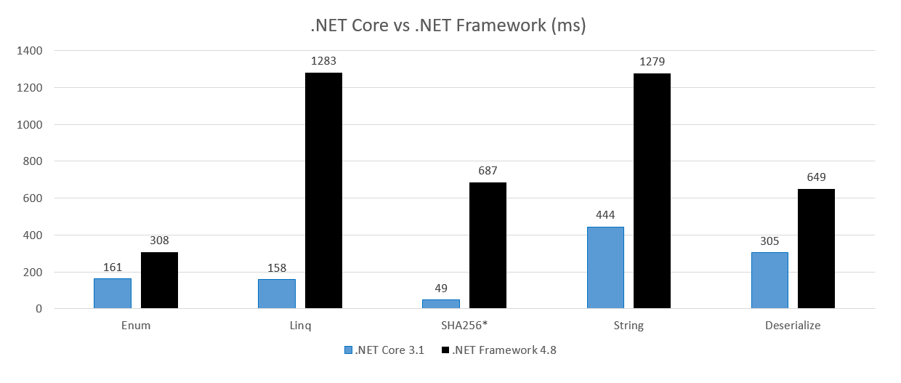

# DotNetFrameworkVsCore
Small console application to compare performance of .NET Framework (4.8), .NET Core (3.1.1) and .NET 5 (preview 1). Common benchmarks are written in .NET Standard. App contains 5 benchmarks to test performance of .NET Framework (4.8), .NET Core (3.1.1) and .NET 5 (preview 1). Results taken by [BenchmarkDotNet](https://benchmarkdotnet.org/).

## .NET 5 preview 1 - fresh and new
.NET 5 is fresh, shiny and ready to test with first preview version. To check new runtime you have to download [Visual Studio 2019 16.6.0 preview](https://visualstudio.microsoft.com/en/vs/preview/) and [.NET 5.0 Preview 1 SDK](https://dotnet.microsoft.com/download/dotnet-core/5.0). 

### .NET 5 preview 1 vs .NET Core 3.2.1
Based on current tests we can assume that runtime performance of that .NET 5 preview 1 and .NET Core 3.x.x are almost identical. In [first announcement](https://devblogs.microsoft.com/dotnet/announcing-net-5-0-preview-1/) was described that team is focused on regular expression performance improvements. Still without any details, but it was promised that blog post is coming shortly. When it will be available - new test(s) will come.

## Code details

### Enum:
```csharp
public DayOfWeek EnumParse() => (DayOfWeek)Enum.Parse(typeof(DayOfWeek), "Thursday");
```

### Linq:
```csharp
//IEnumerable<int> _tenMillionToZero = Enumerable.Range(0, 10_000_000).Reverse();

public void LinqOrderBySkipFirst() => _tenMillionToZero.OrderBy(i => i).Skip(4).First();
```

### SHA256:
```csharp
//byte[] _raw = new byte[100 * 1024 * 1024];
//for (int index = 0; index < _raw.Length; index++) _raw[index] = (byte)index;

public void Sha256() => _sha256.ComputeHash(_raw);
```

### String:
```csharp
// static string _s = "abcdefghijklmnopqrstuvwxyz";

public void StringStartsWith()
{
    for (int i = 0; i < 100_000_000; i++)
    {
        _s.StartsWith("abcdefghijklmnopqrstuvwxy-", StringComparison.Ordinal);
    }
}
```

### Deserialize:
```csharp
public void Deserialize()
{
    var books = new List<Book>();
    for (int i = 0; i < 1_00000; i++)
    {
        string id = i.ToString();
        books.Add(new Book { Name = id, Id = id });
    }

    var formatter = new BinaryFormatter();
    var mem = new MemoryStream();
    formatter.Serialize(mem, books);
    mem.Position = 0;

    formatter.Deserialize(mem);
}
```

## Results



### Intel  Core i7-4702MQ CPU 2.20GHz (Hasewell), Windows 10 (1909)
#### .NET Framework 4.8
- Enum -  303 ns
- Linq - 1 834 ms
- SHA256 - 1 216 ms
- String - 1 857 ms
- Deserialize - 778 ms
#### .NET Core 3.1.1
- Enum -  156 ns
- Linq - 211 ms
- SHA256 - 479 ms
- String - 879 ms
- Deserialize - 424 ms

### AMD Ryzen 7 3700X, Windows 10 (1903 (?))
#### .NET Framework 4.8
- Enum -  231 ns
- Linq - 1 283 ms
- SHA256 - 687 ms
- String - 1 279 ms
- Deserialize - 645 ms
#### .NET Core 3.0 (prev 8)
- Enum -  129 ns
- Linq - 158 ms
- SHA256 - 49 ms
- String - 444 ms
- Deserialize - 305 ms

## Summary
.NET Core is much, much faster than .NET Framework:

Benchmark | Ratio | Notes
------------ | ------------- | -------------
Enum | 2x | Improved Enum.Parse/TryParse
Linq | 8x | Linq optimizations, rewritten operators
SHA256 | 2-14x | Native cryptography in C++ (.NET Framework doesn't utilize AMD's cryptography features!) - CNG on Windows / OpenSSL on Unix. More about why and how AMD is faster you can find here: [Will AMD’s Ryzen finally bring SHA extensions to Intel’s CPUs?](https://neosmart.net/blog/2017/will-amds-ryzen-finally-bring-sha-extensions-to-intels-cpus/)
String | 2-3x | Improvements related to String/Char
Deserialize | 2-12x | Better deserialization performance on biggers objects