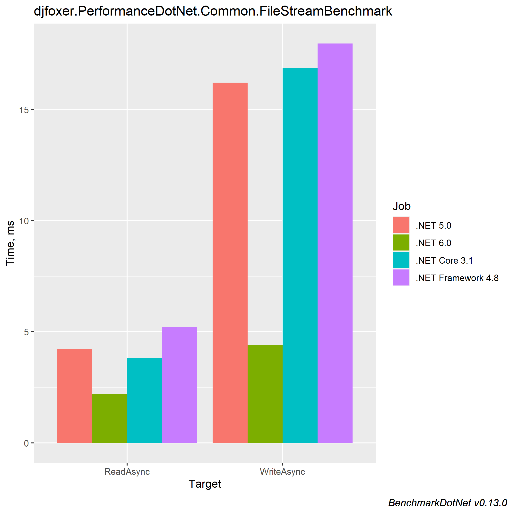

# .NET 6 FileStream Performance Boost

``` ini

BenchmarkDotNet=v0.13.0, OS=Windows 10.0.19043.985 (21H1/May2021Update)
Intel Core i7-4702MQ CPU 2.20GHz (Haswell), 1 CPU, 8 logical and 4 physical cores
.NET SDK=6.0.100-preview.4.21255.9
  [Host]             : .NET 5.0.5 (5.0.521.16609), X64 RyuJIT
  .NET 5.0           : .NET 5.0.7 (5.0.721.25508), X64 RyuJIT
  .NET 6.0           : .NET 6.0.0 (6.0.21.25307), X64 RyuJIT
  .NET Core 3.1      : .NET Core 3.1.16 (CoreCLR 4.700.21.26205, CoreFX 4.700.21.26205), X64 RyuJIT
  .NET Framework 4.8 : .NET Framework 4.8 (4.8.4360.0), X64 RyuJIT


```
|     Method |                Job |            Runtime |      Mean |     Error |    StdDev |    Median | Ratio | RatioSD |
|----------- |------------------- |------------------- |----------:|----------:|----------:|----------:|------:|--------:|
|  ReadAsync |           .NET 5.0 |           .NET 5.0 |  4.229 ms | 0.0331 ms | 0.0276 ms |  4.217 ms |  0.81 |    0.01 |
|  ReadAsync |           .NET 6.0 |           .NET 6.0 |  2.182 ms | 0.0434 ms | 0.0886 ms |  2.173 ms |  0.43 |    0.02 |
|  ReadAsync |      .NET Core 3.1 |      .NET Core 3.1 |  3.810 ms | 0.0275 ms | 0.0214 ms |  3.809 ms |  0.73 |    0.00 |
|  ReadAsync | .NET Framework 4.8 | .NET Framework 4.8 |  5.205 ms | 0.0197 ms | 0.0175 ms |  5.208 ms |  1.00 |    0.00 |
|            |                    |                    |           |           |           |           |       |         |
| WriteAsync |           .NET 5.0 |           .NET 5.0 | 16.206 ms | 0.2806 ms | 0.4285 ms | 16.146 ms |  0.90 |    0.07 |
| WriteAsync |           .NET 6.0 |           .NET 6.0 |  4.408 ms | 0.0836 ms | 0.1117 ms |  4.391 ms |  0.24 |    0.02 |
| WriteAsync |      .NET Core 3.1 |      .NET Core 3.1 | 16.873 ms | 0.4392 ms | 1.2601 ms | 16.313 ms |  0.94 |    0.09 |
| WriteAsync | .NET Framework 4.8 | .NET Framework 4.8 | 17.969 ms | 0.4371 ms | 1.2541 ms | 17.220 ms |  1.00 |    0.00 |


