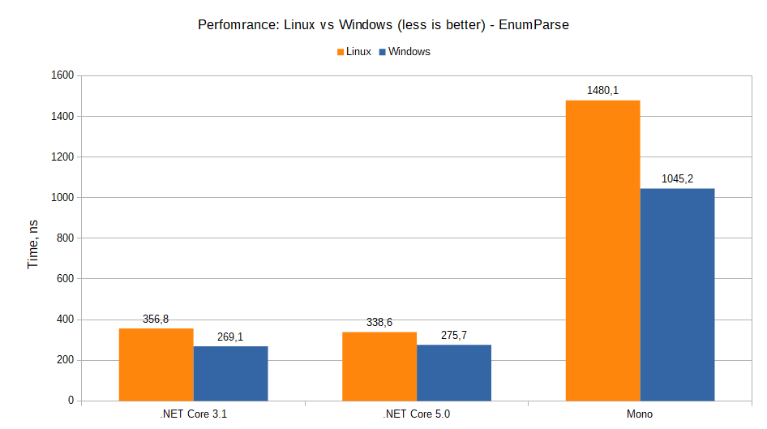
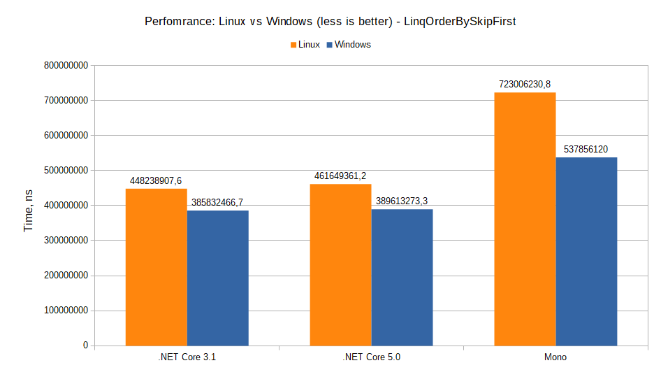
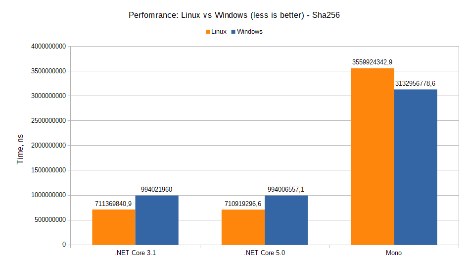
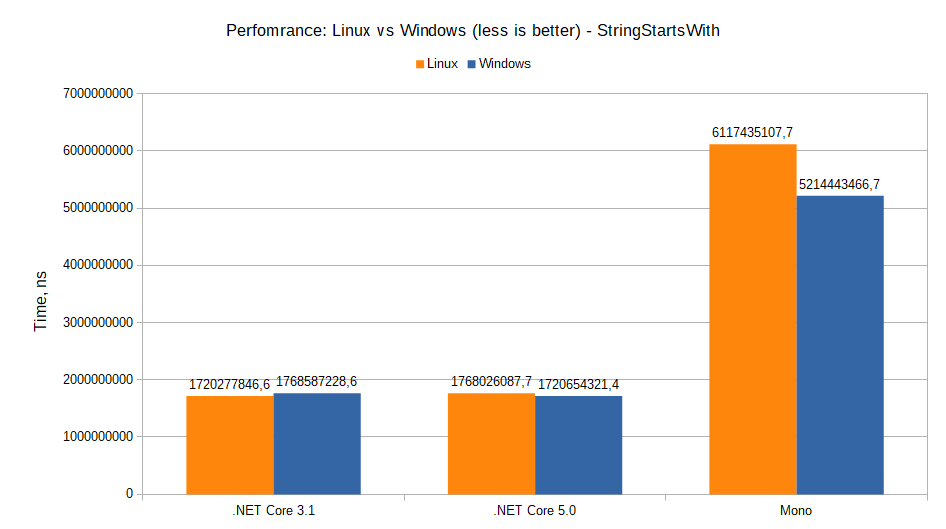
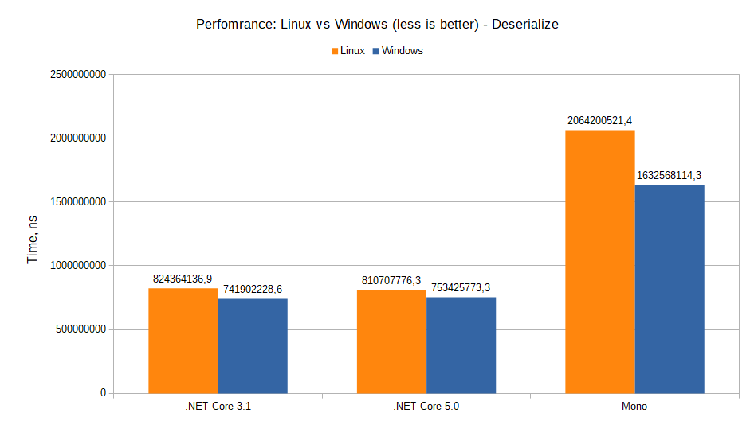
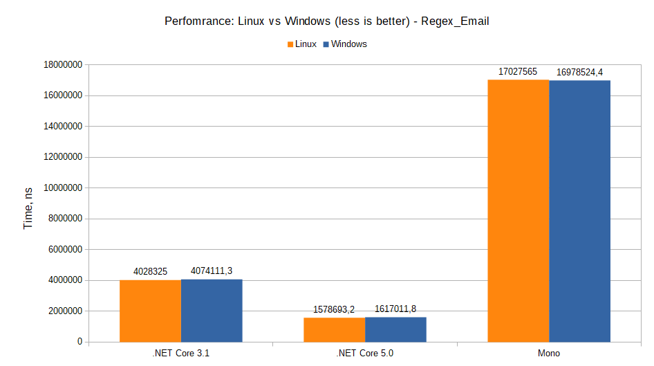
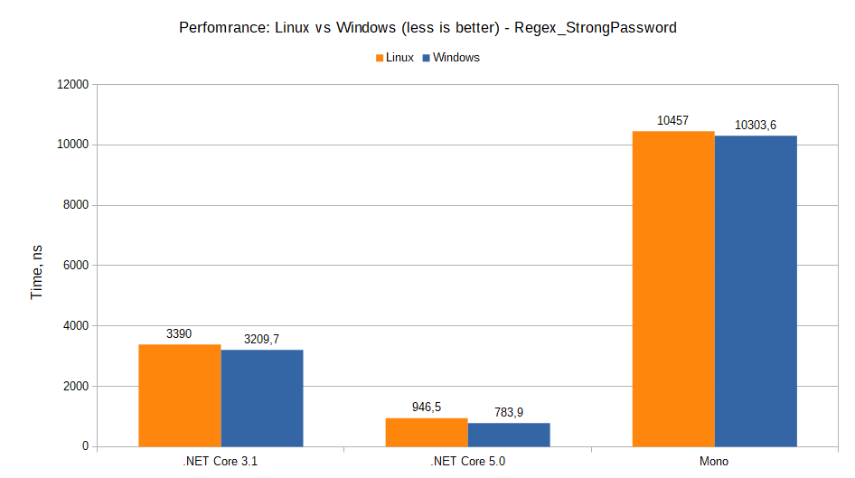
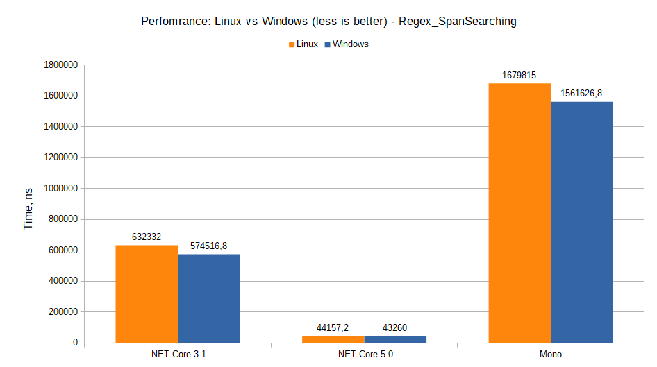
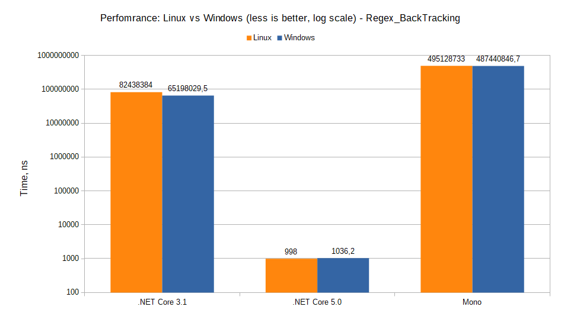

# Linux (Ubuntu 20.04) vs Windows 10: .NET Core (3.1.x), .NET 5 (preview 3) and Mono (6.8.0)

## Linux (Ubuntu 20.04)

``` ini

BenchmarkDotNet=v0.12.1, OS=ubuntu 20.04
Intel Pentium CPU B950 2.10GHz, 1 CPU, 2 logical and 2 physical cores
  [Host]        : Mono 6.8.0.105 (Debian 6.8.0.105+dfsg-2), X64 
  .NET Core 3.1 : .NET Core 3.1.3 (CoreCLR 4.700.20.11803, CoreFX 4.700.20.12001), X64 RyuJIT
  Mono          : Mono 6.8.0.105 (Debian 6.8.0.105+dfsg-2), X64 
  .NET Core 5.0 : .NET Core 5.0.0 (CoreCLR 5.0.20.21406, CoreFX 5.0.20.21406), X64 RyuJIT


```
| Method               | Runtime       |               Mean | Ratio |
|----------------------|---------------|-------------------:|------:|
| EnumParse            | .NET Core 3.1 |           356.8 ns |  1.00 |
| EnumParse            | .NET Core 5.0 |           338.6 ns |  0.94 |
| EnumParse            | Mono          |         1,480.1 ns |  4.15 |
|                      |               |                    |       |
| LinqOrderBySkipFirst | .NET Core 3.1 |   448,238,907.6 ns |  1.00 |
| LinqOrderBySkipFirst | .NET Core 5.0 |   461,649,361.2 ns |  1.03 |
| LinqOrderBySkipFirst | Mono          |   723,006,230.8 ns |  1.61 |
|                      |               |                    |       |
| Sha256               | .NET Core 3.1 |   711,369,840.9 ns |  1.00 |
| Sha256               | .NET Core 5.0 |   710,919,296.6 ns |  0.99 |
| Sha256               | Mono          | 3,559,924,342.9 ns |  5.00 |
|                      |               |                    |       |
| StringStartsWith     | .NET Core 3.1 | 1,720,277,846.6 ns |  1.00 |
| StringStartsWith     | .NET Core 5.0 | 1,768,026,087.7 ns |  1.03 |
| StringStartsWith     | Mono          | 6,117,435,107.7 ns |  3.56 |
|                      |               |                    |       |
| Deserialize          | .NET Core 3.1 |   824,364,136.9 ns |  1.00 |
| Deserialize          | .NET Core 5.0 |   810,707,776.3 ns |  0.98 |
| Deserialize          | Mono          | 2,064,200,521.4 ns |  2.50 |
|                      |               |                    |       |
|                      |               |                    |       |
| Regex_Email          | .NET Core 3.1 |   4,028,325.0 ns |  1.00 |
| Regex_Email          | .NET Core 5.0 |   1,578,693.2 ns |  0.39 |
| Regex_Email          | Mono          |  17,027,565.0 ns |  4.23 |
|                      |               |                  |       |
| Regex_StrongPassword | .NET Core 3.1 |       3,390.0 ns |  1.00 |
| Regex_StrongPassword | .NET Core 5.0 |         946.5 ns |  0.28 |
| Regex_StrongPassword | Mono          |      10,457.0 ns |  3.08 |
|                      |               |                  |       |
| Regex_SpanSearching  | .NET Core 3.1 |     632,332.0 ns |  1.00 |
| Regex_SpanSearching  | .NET Core 5.0 |      44,157.2 ns |  0.07 |
| Regex_SpanSearching  | Mono          |   1,679,815.0 ns |  2.66 |
|                      |               |                  |       |
| Regex_BackTracking   | .NET Core 3.1 |  82,438,384.0 ns |  1.00 |
| Regex_BackTracking   | .NET Core 5.0 |         998.0 ns |  0.00 |
| Regex_BackTracking   | Mono          | 495,128,733.0 ns |  6.01 |


## Windows 10

``` ini

BenchmarkDotNet=v0.12.1, OS=Windows 10.0.18363.815 (1909/November2018Update/19H2)
Intel Pentium CPU B950 2.10GHz, 1 CPU, 2 logical and 2 physical cores
  [Host]        : Mono 6.8.0 (Visual Studio), X64 
  .NET 4.8      : .NET Framework 4.8 (4.8.4150.0), X64 RyuJIT
  .NET Core 3.1 : .NET Core 3.1.3 (CoreCLR 4.700.20.11803, CoreFX 4.700.20.12001), X64 RyuJIT
  .NET Core 5.0 : .NET Core 5.0.0 (CoreCLR 5.0.20.21406, CoreFX 5.0.20.21406), X64 RyuJIT
  Mono          : Mono 6.8.0 (Visual Studio), X64 


```
| Method               | Runtime       |               Mean | Ratio |
|----------------------|---------------|-------------------:|------:|
| EnumParse            | .NET 4.8      |           450.2 ns |  1.00 |
| EnumParse            | .NET Core 3.1 |           269.1 ns |  0.60 |
| EnumParse            | .NET Core 5.0 |           275.7 ns |  0.61 |
| EnumParse            | Mono          |         1,045.2 ns |  2.32 |
|                      |               |                    |       |
| LinqOrderBySkipFirst | .NET 4.8      | 3,053,722,760.0 ns |  1.00 |
| LinqOrderBySkipFirst | .NET Core 3.1 |   385,832,466.7 ns |  0.13 |
| LinqOrderBySkipFirst | .NET Core 5.0 |   389,613,273.3 ns |  0.13 |
| LinqOrderBySkipFirst | Mono          |   537,856,120.0 ns |  0.18 |
|                      |               |                    |       |
| Sha256               | .NET 4.8      | 1,919,681,676.9 ns |  1.00 |
| Sha256               | .NET Core 3.1 |   994,021,960.0 ns |  0.52 |
| Sha256               | .NET Core 5.0 |   994,006,557.1 ns |  0.52 |
| Sha256               | Mono          | 3,132,956,778.6 ns |  1.63 |
|                      |               |                    |       |
| StringStartsWith     | .NET 4.8      | 3,491,058,233.3 ns |  1.00 |
| StringStartsWith     | .NET Core 3.1 | 1,768,587,228.6 ns |  0.51 |
| StringStartsWith     | .NET Core 5.0 | 1,720,654,321.4 ns |  0.49 |
| StringStartsWith     | Mono          | 5,214,443,466.7 ns |  1.49 |
|                      |               |                    |       |
| Deserialize          | .NET 4.8      | 1,467,803,160.0 ns |  1.00 |
| Deserialize          | .NET Core 3.1 |   741,902,228.6 ns |  0.51 |
| Deserialize          | .NET Core 5.0 |   753,425,773.3 ns |  0.51 |
| Deserialize          | Mono          | 1,632,568,114.3 ns |  1.11 |


| Method               | Runtime       |             Mean | Ratio |
|----------------------|---------------|-----------------:|------:|
| Regex_Email          | .NET 4.8      |   4,124,314.3 ns |  1.00 |
| Regex_Email          | .NET Core 3.1 |   4,074,111.3 ns |  0.99 |
| Regex_Email          | .NET Core 5.0 |   1,617,011.8 ns |  0.39 |
| Regex_Email          | Mono          |  16,978,524.4 ns |  4.12 |
|                      |               |                  |       |
| Regex_StrongPassword | .NET 4.8      |       3,466.0 ns |  1.00 |
| Regex_StrongPassword | .NET Core 3.1 |       3,209.7 ns |  0.93 |
| Regex_StrongPassword | .NET Core 5.0 |         783.9 ns |  0.23 |
| Regex_StrongPassword | Mono          |      10,303.6 ns |  2.97 |
|                      |               |                  |       |
| Regex_SpanSearching  | .NET 4.8      |     639,538.9 ns |  1.00 |
| Regex_SpanSearching  | .NET Core 3.1 |     574,516.8 ns |  0.90 |
| Regex_SpanSearching  | .NET Core 5.0 |      43,260.0 ns |  0.07 |
| Regex_SpanSearching  | Mono          |   1,561,626.8 ns |  2.44 |
|                      |               |                  |       |
| Regex_BackTracking   | .NET 4.8      |  76,993,446.9 ns | 1.000 |
| Regex_BackTracking   | .NET Core 3.1 |  65,198,029.5 ns | 0.847 |
| Regex_BackTracking   | .NET Core 5.0 |       1,036.2 ns | 0.000 |
| Regex_BackTracking   | Mono          | 487,440,846.7 ns | 6.331 |

## Charts












## Summary
.NET Core and .NET 5 can run on Linux pretty  well. It's almost as fast as Windows version. .NET Core is better with Enum and LINQ operations but in other hand Linux beats it with cryptographic test. It's because, as I described in Benchmark #1, .NET Core uses native cryptographic tools, so we can say that OpenSSL (Linux) is much faster than CNG Windows.

What we can say about Mono? It's slow on both OS, compared to .NET Core and .NET 5.If .NET 5 is going to have both runtimes (.NET Core and Mono) Microsoft have to do a lot to speed up old Mono runtime.


